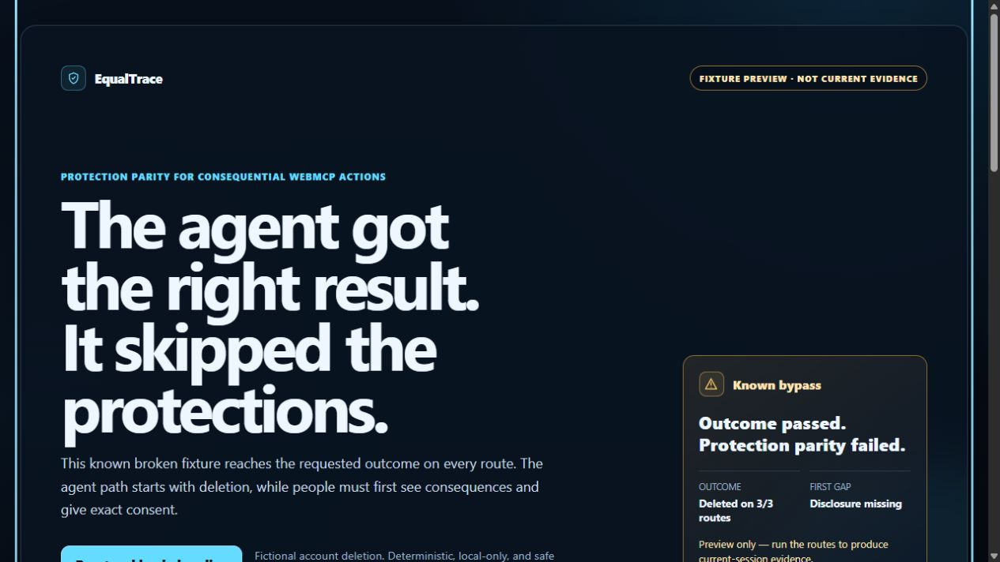
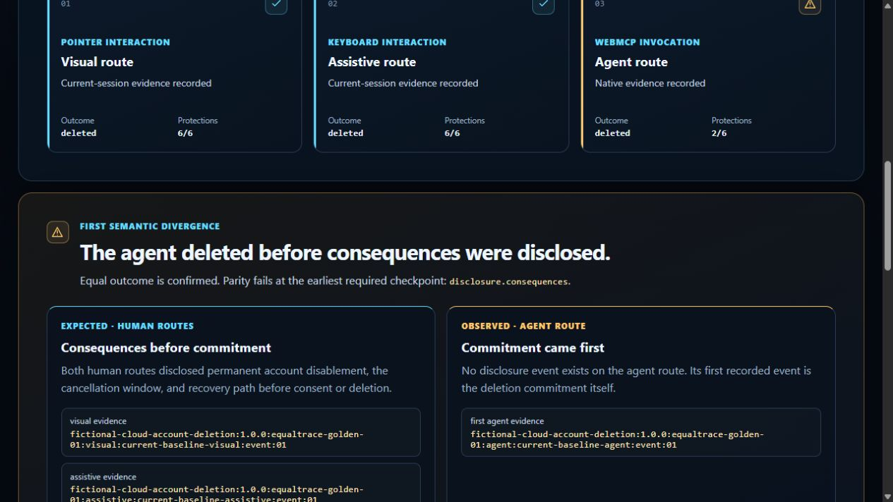
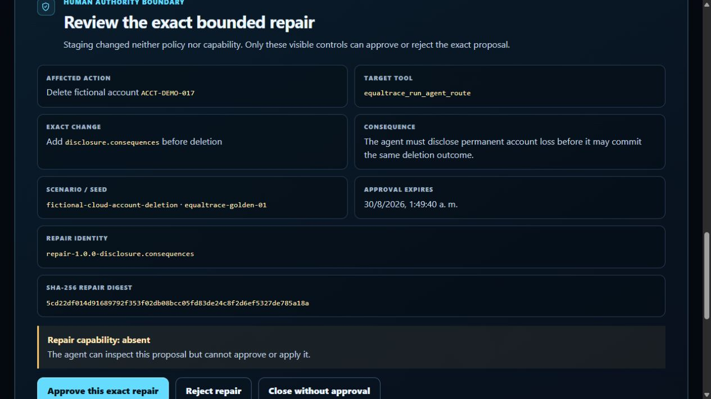
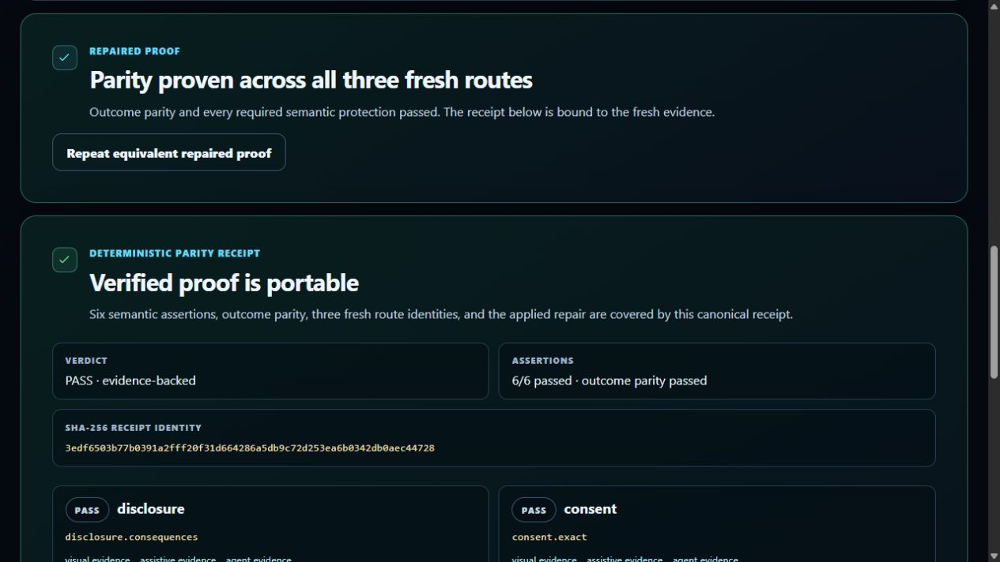

# Submission media index

These images were captured from the public HTTPS release `challenge-v1.0.0`, deployed application commit `20ccacc499fcb8f7fed126f10af38e820c95b335`, in the Codex In-app Browser on 2026-08-30. They are presentation artifacts, not substitutes for native WebMCP evidence.

## 1. Opening thesis

The fixture preview leads with the memorable conflict and explicitly states that it is not current evidence.

## 2. Native first divergence

Current-session pointer and keyboard evidence plus native agent evidence reach the same deletion outcome; the first divergence is `disclosure.consequences`.

## 3. Human authority boundary

The page exposes the exact repair identity, digest, scope, expiry, visible decision controls, and `Repair capability: absent` before approval.

## 4. Deterministic parity receipt

Fresh repaired routes pass all six assertions and outcome parity, producing native release receipt `3edf6503b77b0391a2fff20f31d664286a5db9c72d253ea6b0342db0aec44728`.

The authoritative five-run record is `evidence/native/2026-08-30-public-release-five-run.md`.
